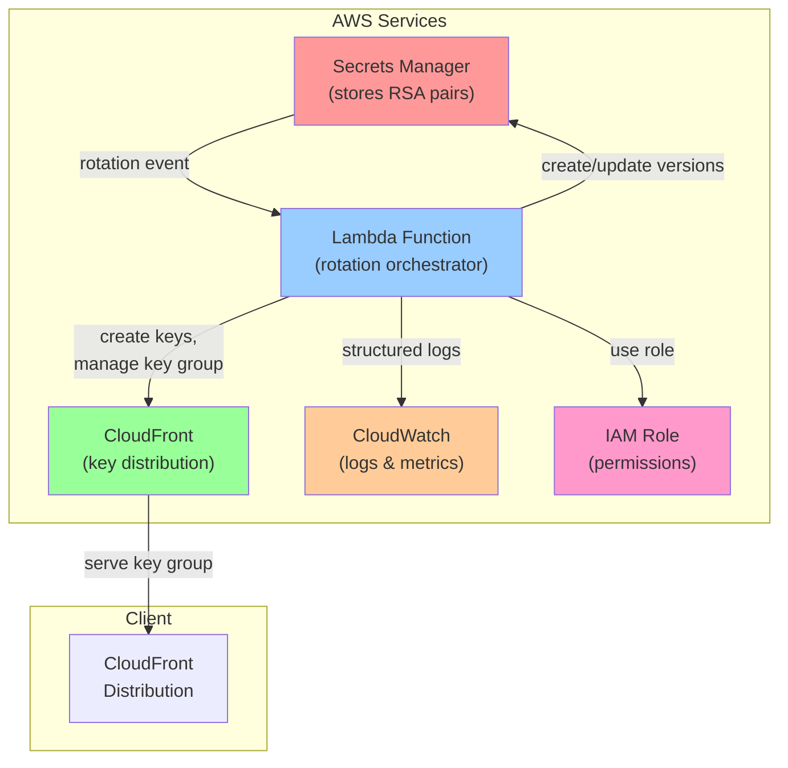
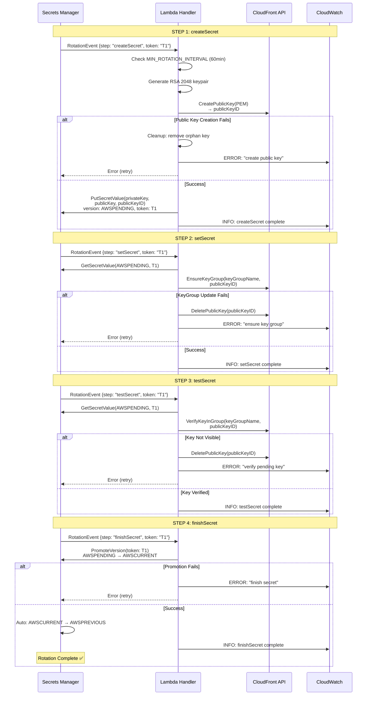
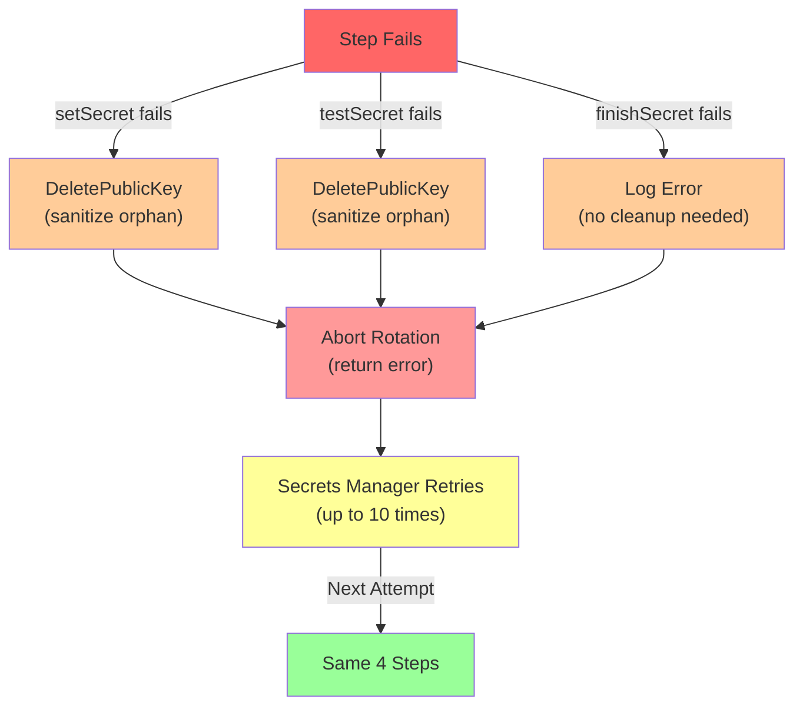
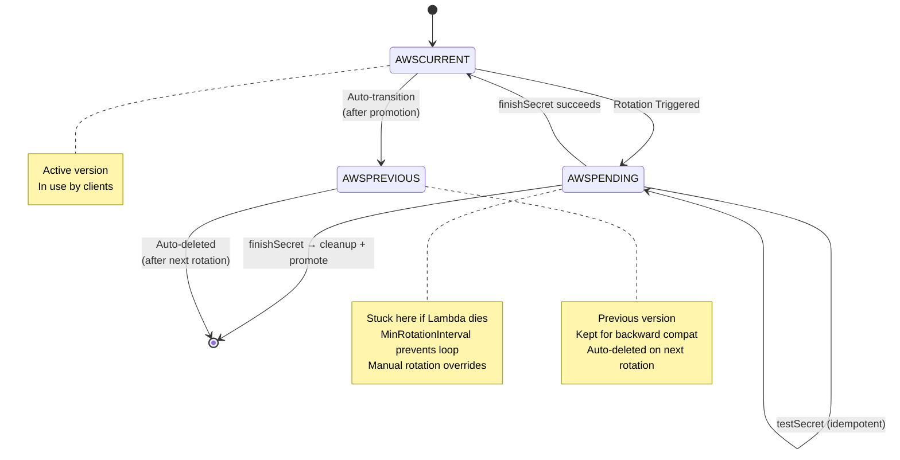
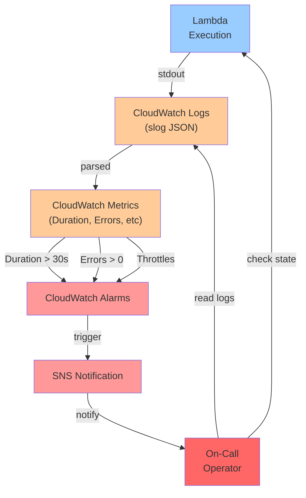
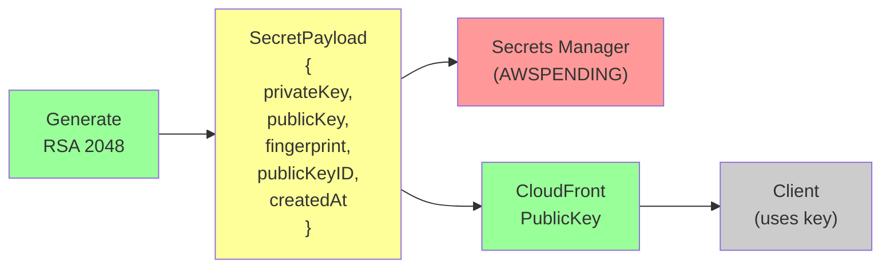
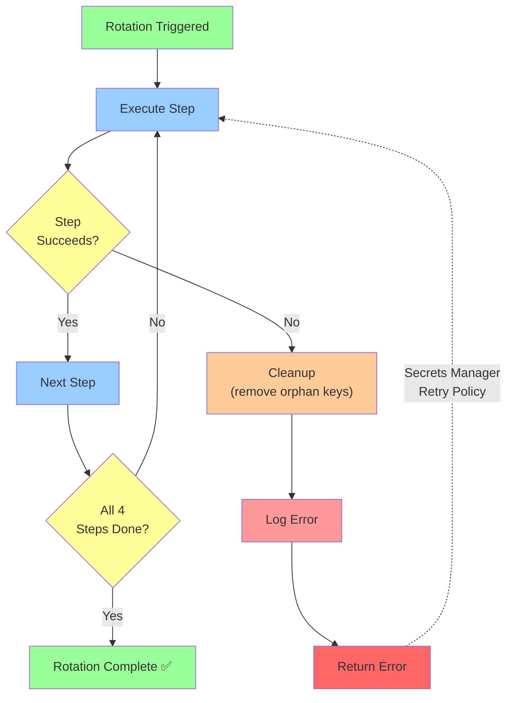

# Architecture Diagrams: go-edge-key-management

Mermaid diagrams for architecture overview and rotation sequence.

---

## System Architecture



**Components:**
- **Secrets Manager** — Stores current + previous RSA keypairs, triggers rotation
- **Lambda** — Handler for 4-step rotation contract (createSecret → setSecret → testSecret → finishSecret)
- **CloudFront** — Distributes public keys via key groups
- **CloudWatch** — Structured logging (slog), metrics, alarms
- **IAM** — Least-privilege role for Lambda access

---

## 4-Step Rotation Sequence



**Key Points:**
1. **createSecret** — Generate keypair, create public key in CloudFront
   - Idempotent: cleans up orphan keys on failure
   - Enforces MinRotationInterval (60min default)

2. **setSecret** — Add public key to CloudFront KeyGroup
   - Fails if KeyGroup update fails (with cleanup)
   - Evicts oldest key if at MaxKeysInGroup limit

3. **testSecret** — Verify public key is visible in KeyGroup
   - Gate: prevents timing gaps between create and visibility
   - Fails if key not yet propagated

4. **finishSecret** — Promote AWSPENDING to AWSCURRENT
   - Idempotent: same token = safe retry
   - Secrets Manager auto-handles AWSCURRENT → AWSPREVIOUS

---

## Cleanup Flow (Error Path)



**Cleanup Strategy:**
- **createSecret fail:** Remove orphan public key before return
- **setSecret fail:** Remove orphan public key before abort
- **testSecret fail:** Remove orphan public key before abort
- **finishSecret fail:** No cleanup needed (already in CloudFront KeyGroup)

Result: No orphan resources accumulate on failure.

---

## State Machine: Secrets Manager Versions



**Version Lifecycle:**
1. Start: `AWSCURRENT` only
2. Rotation triggered: Create `AWSPENDING`
3. All 4 steps complete: `AWSPENDING` → `AWSCURRENT`
4. Auto: Old `AWSCURRENT` → `AWSPREVIOUS`
5. Next rotation: `AWSPREVIOUS` auto-deleted

---

## CloudFront KeyGroup Lifecycle

```mermaid
graph LR
    A["KeyGroup Empty"]
    B["KeyGroup: [Key1]"]
    C["KeyGroup: [Key2, Key1]"]
    D["KeyGroup: [Key3, Key2]"]
    E["KeyGroup: [Key1, Key3]"]
    
    A -->|createSecret<br/>add Key1| B
    B -->|createSecret<br/>add Key2| C
    C -->|createSecret<br/>evict Key1<br/>add Key3| D
    D -->|createSecret<br/>evict Key2<br/>add Key1| E
    
    style A fill:#cccccc
    style B fill:#99ff99
    style C fill:#99ff99
    style D fill:#99ff99
    style E fill:#99ff99
    
    Note over B,E: MAX_KEYS_IN_GROUP: 3<br/>Oldest key evicted when at limit
```

**Key Group Management:**
- Max size: `MaxKeysInGroup` (default 3)
- Order: Newest first (insertion order)
- Eviction: Oldest removed when at limit
- Idempotent: Adding same key twice is no-op

---

## Monitoring & Alerting Flow



**Observability:**
- **Logs** — Structured JSON per step (slog)
- **Metrics** — Duration, errors, throttles, concurrency
- **Alarms** — Errors > 0, Duration > 30s, Throttles > 0
- **On-Call** — Notified via SNS, uses FAILURE_RUNBOOK.md to diagnose

---

## Data Flow: Secret Payload



**Payload Contents:**
- `privateKey` — PEM-encoded, stored in Secrets Manager
- `publicKey` — PEM-encoded, sent to CloudFront
- `fingerprint` — SHA256 hash, unique per keypair
- `publicKeyID` — AWS-assigned CloudFront ID
- `createdAt` — Timestamp for audit

---

## Error Recovery Loop



**Flow:**
1. Execute step (createSecret, setSecret, testSecret, finishSecret)
2. If fails → cleanup + log error + return to Secrets Manager
3. If succeeds → move to next step
4. Secrets Manager retries (automatic, up to 10 times)
5. Success → rotation complete

---

## References

- Full details: [ARCHITECTURE.md](ARCHITECTURE.md)
- Troubleshooting: [FAILURE_RUNBOOK.md](FAILURE_RUNBOOK.md)
- Operations: [OPERATIONS.md](OPERATIONS.md)
- Risk analysis: [RISK_ANALYSIS.md](RISK_ANALYSIS.md)
